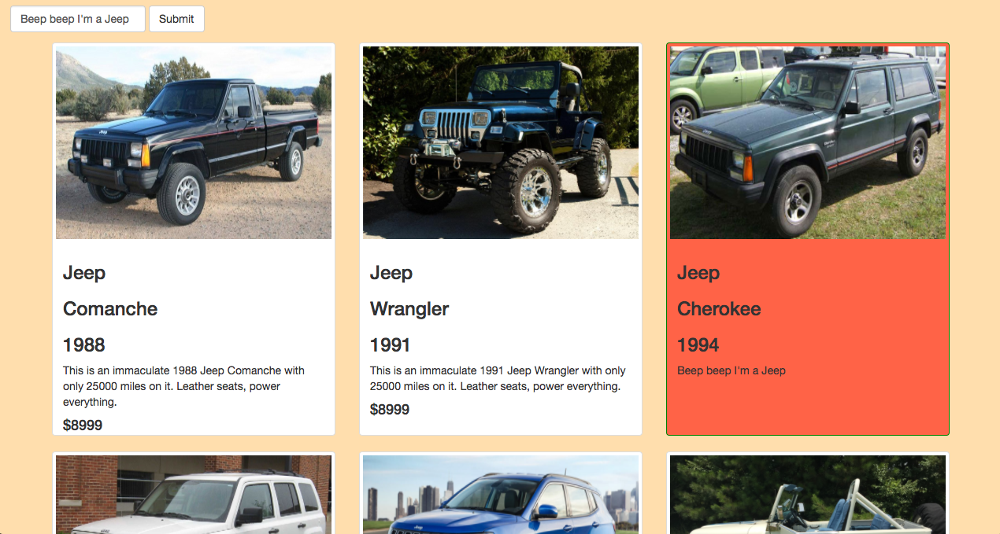

# NSS spa-milestone-challenge

## Description:

Use an IIFE structure to load JSON data and dynamically create cards displaying cars' data and image. When any part of the card is clicked, the input field comes into focus and will allow the user to edit the description of whatever is currently chosen.

### Technical Requirements:

1. Create one global variable (e.g. `CarLot`) and use the IIFE pattern to augment it two times in separate JavaScript files.
1. The first IIFE should add a public function (e.g. `loadInventory`) that loads the `inventory.json` file and stores the inventory in a private variable. It should also expose a public getter to read the array of cars (e.g. `getInventory`).
1. The second IIFE should augment the original one with a function that creates all of the `eventHandlers` that you need for the application. Name the function `activateEvents`.
1. The final IIFE should augment the object with two more functions. One function resets the border thickness and background color for each car element back to the original values. The other function changes the thickness of the border of a car element, and changes its background color. The function must accept two arguments.
    1. A car DOM element that was clicked on.
    1. A color name of your choice (see behavior requirement 5 above).
1. Have a complete Readme

### Technologies used:

- HTML
- CSS
- Bootstrap
- Javascript
- JSON

### Finished project:


### How to run this project (Node must be installed on your machine):

```
git clone git@github.com:nss-evening-cohort-05/spa-milestone-challenge-jmarcusgill.git
cd spa-milestone-challenge-jmarcusgill
npm install http-server -g
http-server -p 8080
This will show in your browser at: http://localhost:8080
```

### Contributors:
[Marcus Gill](https://github.com/jmarcusgill)